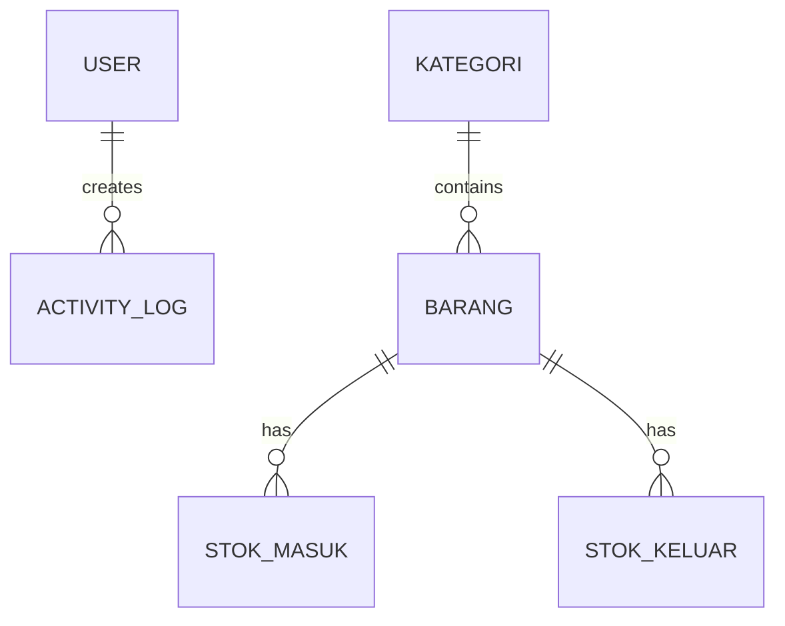

<div align="center">

# 📦 Sistem Inventaris

### Modern Inventory Management System

*Solusi lengkap untuk mengelola stok barang dengan efisien dan terstruktur*

[](https://www.php.net/)
[](https://www.mysql.com/)
[](https://getbootstrap.com/)
[](LICENSE)

[Demo](#-demo) • [Fitur](#-fitur-utama) • [Instalasi](#-instalasi) • [Dokumentasi](#-dokumentasi)

</div>

---

## 🌟 Tentang Sistem

**Sistem Inventaris** adalah aplikasi berbasis web yang dirancang untuk memudahkan pengelolaan stok barang secara real-time. Dikembangkan dengan teknologi modern dan antarmuka yang intuitif, sistem ini cocok untuk bisnis kecil hingga menengah yang membutuhkan solusi manajemen inventaris yang handal.

### ✨ Mengapa Memilih Sistem Ini?

- 🚀 **Multi-Item Transaction** - Input multiple barang dalam satu transaksi
- 📊 **Dashboard Analytics** - Visualisasi data dengan Chart.js
- 📄 **Auto-Generate Reports** - Export ke Excel & PDF dengan satu klik
- 🔐 **Role-Based Access** - Keamanan dengan sistem role Admin & CS
- 📱 **Responsive Design** - Tampilan optimal di semua perangkat
- 🎯 **User-Friendly** - Interface yang mudah dipahami dan digunakan

---

## 🎯 Fitur Utama

### 📋 Manajemen Master Data
- **Kategori Barang** - Kelola kategori dengan mudah
- **Data Barang** - CRUD lengkap dengan auto-generate kode barang
- **Status Stok** - Indikator visual (Aman, Menipis, Habis)
- **Pencarian & Filter** - Temukan data dengan cepat

### 🔄 Transaksi Multi-Item
- **Stok Masuk** - Input multiple barang dengan supplier tracking
- **Stok Keluar** - Validasi stok real-time & auto-generate surat pengeluaran
- **Batch Processing** - Grouping transaksi dengan batch ID
- **Transaction Integrity** - Database transaction untuk data consistency

### 📊 Pelaporan Komprehensif
- **Laporan Stok** - Filter berdasarkan kategori
- **Laporan Transaksi** - Filter range tanggal
- **Export Excel** - Format professional dengan merged cells
- **Print PDF** - Direct download dengan html2pdf.js

### 👥 User Management
- **Role-Based Access Control** - Admin & Customer Service
- **Activity Logging** - Track semua aktivitas user
- **Password Security** - Hashing dengan bcrypt
- **Session Management** - Auto-timeout untuk keamanan

---

## 🛠️ Teknologi

<div align="center">

| Backend | Frontend | Database | Tools |
|---------|----------|----------|-------|
|  |  |  |  |
| PHP 7.4+ | Bootstrap 5.3 | MySQL 5.7+ | Composer |
| |  | |  |
| | Chart.js, SweetAlert2 | | XAMPP |

</div>

### 📚 Libraries & Dependencies
- **PHPSpreadsheet** - Excel generation
- **html2pdf.js** - Client-side PDF generation
- **Font Awesome** - Icon library
- **Chart.js** - Data visualization

---

## 📦 Instalasi

### Prerequisites
- PHP 7.4 atau lebih tinggi
- MySQL 5.7 atau lebih tinggi
- Apache Web Server
- Composer

### Quick Start

```bash
# 1. Clone repository
git clone https://github.com/yourusername/sistem-inventaris.git
cd sistem-inventaris

# 2. Install dependencies
composer install

# 3. Import database
mysql -u root -p < database/inventaris_db.sql

# 4. Konfigurasi database
cp config/koneksi.example.php config/koneksi.php
# Edit config/koneksi.php sesuai dengan setup database Anda

# 5. Jalankan migrations
php migrations/run_migration.php

# 6. Akses aplikasi
http://localhost/inventaris
```

### Default Login

```
Username: admin
Password: admin123
```

> ⚠️ **Penting**: Segera ubah password default setelah login pertama!

---

## 📖 Dokumentasi

### Struktur Direktori

```
inventaris/
├── assets/              # CSS, JS, dan static files
├── auth/                # Authentication (login, logout)
├── config/              # Konfigurasi dan helper functions
├── includes/            # Header, sidebar, navbar, footer
├── master/              # Master data (kategori, barang)
├── transaksi/           # Stok masuk, keluar, surat pengeluaran
├── laporan/             # Reports dan exports
├── pengaturan/          # User management, activity log
├── migrations/          # Database migrations
├── vendor/              # Composer dependencies
└── index.php            # Dashboard
```

### Database Schema



**Tabel Utama:**
- `users` - Data pengguna dan role
- `kategori` - Kategori barang
- `barang` - Master data barang
- `stok_masuk` - Transaksi stok masuk
- `stok_keluar` - Transaksi stok keluar
- `activity_logs` - Log aktivitas user

---

## 🎨 Screenshots

<div align="center">

### Dashboard

*Dashboard dengan statistik real-time dan grafik*

### Multi-Item Transaction

*Form transaksi dengan dynamic add/remove items*

### Reports

*Laporan dengan filter dan export options*

</div>

---

## 🚀 Fitur Unggulan

### 1. Multi-Item Transaction
Input multiple barang dalam satu transaksi dengan validasi real-time:
- ✅ Dynamic add/remove item rows
- ✅ Duplicate item detection
- ✅ Stock availability check
- ✅ Batch ID grouping

### 2. Auto-Generate Documents
Sistem otomatis generate dokumen profesional:
- 📄 Surat Pengeluaran Barang (auto-print)
- 📊 Laporan Excel dengan format header
- 🖨️ PDF download langsung tanpa dialog

### 3. Real-Time Validation
Validasi instant untuk mencegah error:
- ⚠️ Warning jika stok tidak cukup
- 🚫 Block submit jika ada error
- ✓ Visual feedback untuk setiap aksi

---

## 🔐 Keamanan

Sistem dilengkapi dengan multiple security layers:

- 🔒 **Password Hashing** - Bcrypt algorithm
- 🛡️ **SQL Injection Prevention** - Prepared statements & escaping
- 🔑 **Session Security** - Auto-timeout & validation
- 👮 **Role-Based Access Control** - Granular permissions
- 📝 **Activity Logging** - Complete audit trail

---

## 📊 Use Cases

### Cocok untuk:
- 🏪 Toko retail
- 🏭 Gudang penyimpanan
- 🏢 Kantor dengan inventory
- 🏥 Klinik/Apotek (non-medical)
- 🎓 Laboratorium sekolah/kampus

---

## 🤝 Kontribusi

Kontribusi sangat diterima! Berikut cara berkontribusi:

1. Fork repository ini
2. Buat branch fitur (`git checkout -b feature/AmazingFeature`)
3. Commit perubahan (`git commit -m 'Add some AmazingFeature'`)
4. Push ke branch (`git push origin feature/AmazingFeature`)
5. Buat Pull Request

### Development Guidelines
- Follow PSR-12 coding standards
- Write clear commit messages
- Add comments untuk code yang kompleks
- Test sebelum submit PR

---

## 📝 Changelog

### Version 2.0.0 (2025-01-01)
- ✨ **NEW**: Multi-item transaction untuk stok masuk & keluar
- ✨ **NEW**: Batch ID untuk grouping transaksi
- ✨ **NEW**: Direct PDF download dengan html2pdf.js
- 🐛 **FIX**: Excel export button functionality
- 🐛 **FIX**: Print color untuk badges
- 🎨 **IMPROVE**: Responsive design untuk mobile
- 🎨 **IMPROVE**: Activity logging system

### Version 1.0.0 (2024-12-01)
- 🎉 Initial release
- ✅ Basic CRUD operations
- ✅ Single-item transactions
- ✅ Reports & exports

---

## 📄 License

Distributed under the MIT License. See `LICENSE` for more information.

---

## 👨‍💻 Author

**[Your Name]**

- GitHub: [@yourusername](https://github.com/yourusername)
- Email: your.email@example.com
- LinkedIn: [Your Name](https://linkedin.com/in/yourprofile)

---

## 🙏 Acknowledgments

- [Bootstrap](https://getbootstrap.com/) - Frontend framework
- [Chart.js](https://www.chartjs.org/) - Data visualization
- [SweetAlert2](https://sweetalert2.github.io/) - Beautiful alerts
- [PHPSpreadsheet](https://phpspreadsheet.readthedocs.io/) - Excel generation
- [Font Awesome](https://fontawesome.com/) - Icon library

---

## 📞 Support

Jika Anda menemukan bug atau memiliki pertanyaan:

- 🐛 [Report Bug](https://github.com/yourusername/sistem-inventaris/issues)
- 💡 [Request Feature](https://github.com/yourusername/sistem-inventaris/issues)
- 📧 [Email Support](mailto:your.email@example.com)

---

<div align="center">

### ⭐ Jika project ini membantu, berikan star!

**Made with ❤️ by [Your Name]**

[⬆ Back to Top](#-sistem-inventaris)

</div>